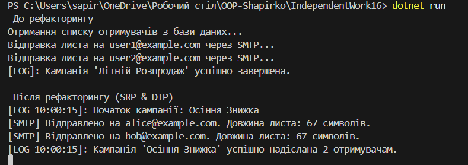

## Самостійна робота №16
## Виконав: Шапірко Максим
### Тема: Схема розподілу відповідальностей модуля.
### Мета: Навчитися застосовувати принцип єдиної відповідальності (SRP) для декомпозиції складного модуля на менші, більш сфокусовані класи, а також візуалізувати розподіл відповідальностей за допомогою діаграми класів (UML).

### Результати виконання роботи: 

### Висновок:
Під час виконання самостійної роботи було практично закріплено принципи об'єктно-орієнтованого проєктування SOLID:
Аналіз: Розглянуто "поганий" клас BadEmailCampaignSender, який порушував принцип єдиної відповідальності (SRP), виконуючи всі етапи розсилки одночасно.
Рефакторинг (SRP та DIP): Монолітний клас розбито на окремі інтерфейси з єдиною відповідальністю (IRecipientProvider,IEmailContentBuilder, IEmailSender, ILogger). Головний сервіс тепер залежить від цих абстракцій (DIP), а не від конкретних реалізацій.
Результат: Завдяки рефакторингу та візуалізації через UML-діаграму створено гнучку, слабозв'язану та модульну архітектуру. Код стало значно легше читати, тестувати та масштабувати у майбутньому.