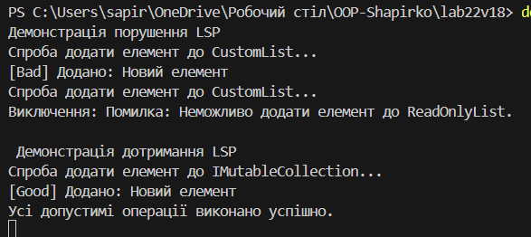

## Лабораторна робота №22
## Виконав: Шапірко Максим ІПЗ 3/1
### Тема: LSP: виявлення порушень і альтернативи.
### Мета: Поглибити розуміння принципу підстановки Лісков (LSP), навчитися ідентифікувати його порушення в ієрархіях класів та застосовувати альтернативні підходи (композиція, зміна ієрархії) для створення LSP-сумісних рішень.

### Результати виконання роботи:

### Висновок:
Під час виконання лабораторної роботи було на практиці досліджено Принцип підстановки Лісков (Liskov Substitution Principle - LSP), який є однією з ключових складових архітектурного підходу SOLID.
В результаті виконання завдання було зроблено наступне:

Аналіз порушення LSP: Продемонстровано поширену архітектурну помилку на прикладі класів CustomList та ReadOnlyList. Успадкування списку "тільки для читання" від звичайного списку порушило контракт базового класу. Клієнтський код, очікуючи можливість додавання елементів (метод Add), отримував виняток (NotSupportedException) під час виконання (runtime error). Це доводить, що похідний клас не може безболісно замінити базовий, якщо він змінює його фундаментальну поведінку.

Рефакторинг та дотримання LSP: Проблему було вирішено шляхом відмови від некоректного наслідування на користь розділення обов'язків через інтерфейси. Було виділено IReadableCollection (для читання) та IMutableCollection (для зміни даних).

Результат: Завдяки новій структурі система стала безпечною та передбачуваною. Замість помилок під час виконання програми (runtime exceptions), ми отримали захист на етапі компіляції (compile-time safety) — компілятор просто не дозволить передати ReadOnlyList у метод, який вимагає колекцію з можливістю додавання елементів.

Загальний підсумок: Дотримання принципу LSP гарантує, що ієрархія класів побудована логічно правильно, поведінка похідних класів відповідає контрактам базових, а система є стійкою до непередбачуваних збоїв під час роботи клієнтського коду.