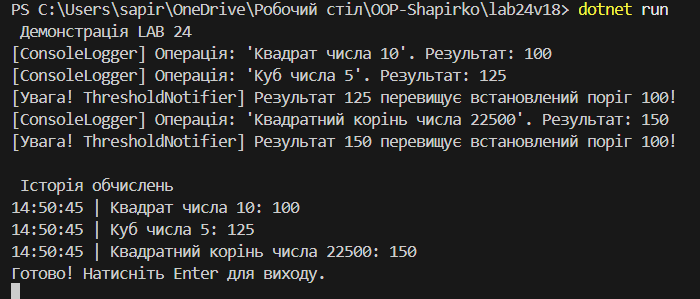

## Лабораторна робота №24
## Виконав: Шапірко Максим ІПЗ 3/1
### Тема: Strategy + Observer: динамічна підстановка алгоритмів + тести.
### Мета: Застосувати патерни Strategy та Observer для створення гнучкої системи, яка дозволяє динамічно змінювати алгоритми обробки даних та автоматично сповіщати залежні компоненти про зміни, а також написати юніт-тести для перевірки цієї функціональності.
### Результати виконання роботи:

### Висновок:
Під час виконання лабораторної роботи було на практиці досліджено та реалізовано поведінкові патерни проєктування Strategy (Стратегія) та Observer (Спостерігач).

В результаті виконання завдання розроблено гнучку систему обробки числових даних:

Застосування патерну Strategy: Логіку математичних обчислень (квадрат, куб, квадратний корінь) було винесено в окремі класи-стратегії, що реалізують спільний інтерфейс INumericOperationStrategy. Це дозволило класу NumericProcessor динамічно змінювати алгоритм обробки чисел під час виконання програми (через метод SetStrategy) без зміни власного коду, що ідеально відповідає принципу відкритості/закритості (Open/Closed Principle).

Застосування патерну Observer: За допомогою вбудованого механізму подій у C# (event Action) реалізовано систему сповіщень. Клас ResultPublisher (Видавець) генерує подію при отриманні результату, а незалежні класи-спостерігачі (ConsoleLoggerObserver, HistoryLoggerObserver, ThresholdNotifierObserver) реагують на неї. Це дозволило повністю відділити логіку обчислень від логіки логування та нотифікацій.

Загальний підсумок: Поєднання цих двох патернів дозволило створити слабкозв'язну (loosely coupled) та модульну архітектуру. Тепер до системи можна легко додавати нові математичні операції (нові стратегії) або нові способи обробки результатів (нові спостерігачі), не змінюючи при цьому вже існуючий базовий код.