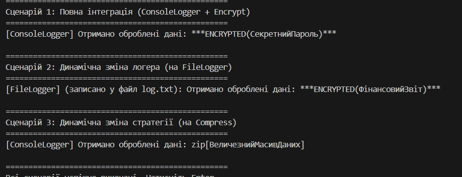

## Лабораторна робота №25
## Виконав Шапірко Максим Вікторович ІПЗ 3/1
###  Тема: Інтеграція патернів (підготовка до екзамену).
### Мета: Розробити систему, що демонструє взаємодію між компонентами, які реалізують патерни Factory Method, Singleton, Strategy та Observer, а також переконатися в коректності їхньої спільної роботи.
 ### Результати виконання роботи:
 
### Висновок: 
Під час виконання лабораторної роботи реалізовано комплексну систему, яка успішно інтегрує чотири патерни проєктування. Factory Method забезпечив гнучке створення логерів, Singleton надав глобальну точку доступу до керування логуванням (LoggerManager), Strategy дозволив динамічно змінювати алгоритми обробки даних (шифрування/стиснення), а Observer організував автоматичне сповіщення системи про завершення обробки. Така архітектура довела свою ефективність: модулі залишаються незалежними, а зміна поведінки програми відбувається динамічно під час виконання (runtime) без втручання в основний код.