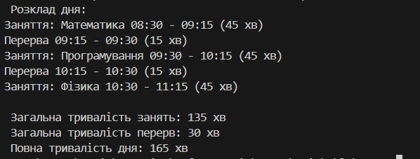

# Лабораторна робота №3 

### Виконав: Шапірко Максим Вікторович ІПЗ 3/1

### Тема: Наслідування: основи

Мета: закріпити знання про базові класи, похідні класи, модифікатори доступу, використання base, поліморфізм у простій формі.

У ході лабораторної роботи №3 було закріплено тему «Наслідування: основи».
Створено базовий клас TimeSpanBase і похідні LessonTime та BreakTime.
Продемонстровано використання наслідування, модифікаторів доступу, ключового слова base та поліморфізму через перевизначення методів.
Програма формує розклад дня й обчислює тривалість занять, перерв і всього дня.
Таким чином закріплено принципи ООП: інкапсуляція, наслідування та поліморфізм.

## Результат виводу на екран

## Контрольні запитання: 

### 1. Що таке наслідування? 
Наслідування — це механізм ООП, який дозволяє створювати нові класи на основі існуючих, успадковуючи їхні властивості та методи.
Використовується для повторного використання коду, розширення функціональності та реалізації поліморфізму.

### 2. Чим відрізняється virtual від abstract методу?
virtual метод
Має реалізацію у базовому класі.
У похідних класах його можна перевизначити (через override), але це не обов’язково. 
abstract метод
Не має реалізації у базовому класі (тільки сигнатура).
Його обов’язково треба реалізувати у всіх похідних класах.
Може бути лише в абстрактному класі.

### 3. Як працює ключове слово base?
base — це ключове слово в C#, яке використовується в похідному класі для доступу до членів (методів, властивостей, конструкторів) базового класу.

### 4. Що таке поліморфізм часу виконання?
Поліморфізм часу виконання (runtime polymorphism) — це властивість ООП, коли виклик методу залежить від реального типу об’єкта під час виконання програми, а не від типу змінної під час компіляції.

### 5. У чому різниця між композицією та наслідуванням?
Наслідування описує відношення «є» (is-a) — коли клас є різновидом іншого класу.
Композиція описує відношення «має» (has-a) — коли клас містить об’єкти інших класів як свої складові.

## Висновок:

 У цій лабораторній я закріпив знання про базові класи, похідні класи, модифікатори доступу, використання base, поліморфізм у простій формі.