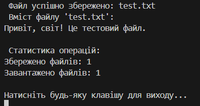

# Лабораторна робота №4

### Виконав: Шапірко Максим Вікторович ІПЗ 3/1

### Тема: Абстракції та інтерфейси. Композиція та агрегація.

Мета: навчитися створювати абстрактні класи та інтерфейси, будувати ієрархії класів із використанням композиції та агрегації, реалізовувати прості обчислення, демонструвати гнучкість і повторне використання коду.

У ході виконання лабораторної роботи було закріплено знання про абстракції та інтерфейси в ООП. Створено інтерфейс і абстрактний клас, реалізовано дві конкретні операції — збереження та завантаження файлів, а також виконано підрахунок кількості операцій.
Під час роботи застосовано принципи наслідування, агрегації та композиції, що продемонструвало гнучкість і повторне використання коду. Отримано практичні навички побудови ієрархій класів і розробки структурованих програм на C#.

## Результат виводу на екран

## Контрольні запитання:

### 1. У чому різниця між абстрактним класом і інтерфейсом?
Різниця між абстрактним класом і інтерфейсом:
Інтерфейс визначає лише контракт — які методи мають бути реалізовані, без їхньої реалізації.
Абстрактний клас може містити як оголошення, так і реалізацію методів, а також поля й конструктори.
Клас може реалізовувати декілька інтерфейсів, але успадковує лише один абстрактний клас.

### 2. Коли краще використовувати композицію, а коли наслідування?
Композицію краще використовувати, коли потрібно поєднати об’єкти, щоб один використовував функціональність іншого, не успадковуючи його — це дає більшу гнучкість.
Наслідування доцільно застосовувати, коли між класами існує відношення “є” (наприклад, Кіт є Тварина), і підклас дійсно розширює поведінку базового класу. 

### 3. Як працює агрегація та чим вона відрізняється від композиції?
Агрегація — це зв’язок між об’єктами, коли один об’єкт містить інший, але підлеглий може існувати окремо (наприклад, університет має студентів — студенти можуть існувати без університету).
Композиція — сильніший зв’язок: підлеглий об’єкт створюється та знищується разом із головним (наприклад, автомобіль має двигун — без автомобіля двигун не існує).

### 4. Чи може клас реалізовувати кілька інтерфейсів одночасно?
Так, клас може реалізовувати кілька інтерфейсів одночасно — це дозволяє об’єднувати різні поведінки в одному класі та забезпечує гнучкість у проєктуванні.

### 5. Для чого в ООП використовують інтерфейси як контракти?
Інтерфейси в ООП використовують як контракти, щоб визначити набір методів і властивостей, які клас зобов’язаний реалізувати. Це забезпечує єдність поведінки різних класів і дозволяє змінювати реалізації без зміни коду, що їх використовує.

## Висновок: 
У цій лабораторній роботі я навчився створювати абстрактні класи та інтерфейси, будувати ієрархії класів із використанням композиції та агрегації, реалізовувати прості обчислення, демонструвати гнучкість і повторне використання коду.

