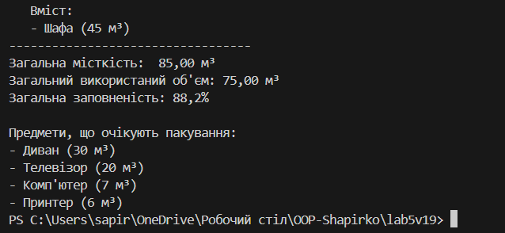

# Лабораторна робота №5

### Виконав: Шапірко Максим Вікторович ІПЗ 3/1

### Тема: Узагальнені типи (Generics), колекції і LINQ, обробка винятків.

Мета: Навчитися створювати узагальнені класи/методи, працювати з колекціями та LINQ, коректно валідувати вхідні дані і створювати/обробляти винятки.

У ході лабораторної роботи №5 було закріплено теми «Композиція, узагальнення та обробка винятків».
Створено модель пакування на складі (PackPlanner, Box, BoxItem). Продемонстровано використання композиції (де PackPlanner володіє коробками), узагальненого компонента (SortedSet<T> для пріоритетної черги) та власних винятків (ItemTooLargeException) для контролю даних.
Програма моделює "жадібне" пакування, обчислює заповненість коробок та обробляє помилки через try-catch. Таким чином закріплено принципи ООП: інкапсуляція, поліморфізм та композиція.

## Результат виводу на екран

## Контрольні запитання: 

### 1. Що таке generics? Які їхні переваги?
Generics (Узагальнення) — це "шаблони" для класів, методів чи інтерфейсів, що дозволяють їм працювати з будь-яким типом даних (позначається як T).

Переваги:

Безпека типів: Компілятор гарантує, що ви працюєте лише з потрібним типом (напр., List<int> прийме лише int), запобігаючи помилкам під час виконання.

Продуктивність: Для типів значень (як int, struct) не відбувається зайвих операцій "упаковки" (boxing) та "розпакування" (unboxing).

### 2. Які основні відмінності між ArrayList і List<T>?

ArrayList — це стара, не-узагальнена колекція. Вона зберігає всі елементи як object. Це небезпечно (потрібне ручне приведення типів) і повільно (викликає boxing/unboxing).

List<T> — це сучасна, узагальнена (generic) колекція. Вона знає тип T, який зберігає. Це безпечно щодо типу та швидко.

### 3. Чим відрізняється Dictionary<TKey,TValue> від List<T>?

List<T> — це впорядкований список елементів. Доступ до них відбувається за числовим індексом (напр., myList[0]). Пошук елемента (не за індексом) повільний (O(n)).

Dictionary<TKey, TValue> — це невпорядкована колекція пар "ключ-значення". Доступ відбувається миттєво за унікальним ключем (напр., myDict["name"]). Пошук за ключем дуже швидкий (O(1))

### 4. У чому перевага LINQ над класичними циклами?

LINQ — декларативний (ви описуєте, що хочете отримати), а цикли — імперативні (як це отримати).

LINQ-запити значно коротші, легше читаються та дозволяють уникнути складних вкладених циклів і умов, що зменшує кількість помилок.

### 5. Як працює ключове слово finally?

Блок finally виконується завжди після завершення блоку try (і catch, якщо він був), незалежно від того, чи сталася помилка.

Він використовується для гарантованого звільнення ресурсів (наприклад, закриття файлу або з'єднання з базою даних), навіть якщо програма "впала".

### 6. Коли доцільно створювати власні класи винятків? 

Коли стандартні винятки .NET (як InvalidOperationException чи ArgumentException) недостатньо точно описують помилку.

Власні винятки (напр., UserNotFoundException або ItemTooLargeException) дозволяють цілеспрямовано "ловити" (catch) специфічні помилки вашої бізнес-логіки.

## Висновок:

У ході виконання цієї лабораторної роботи я навчився створювати узагальнені класи/методи, працювати з колекціями та LINQ, коректно валідувати вхідні дані і створювати/обробляти винятки.

