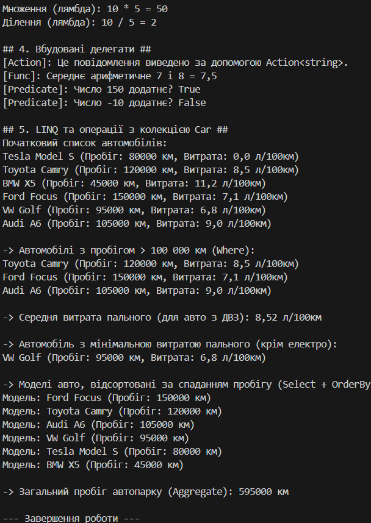
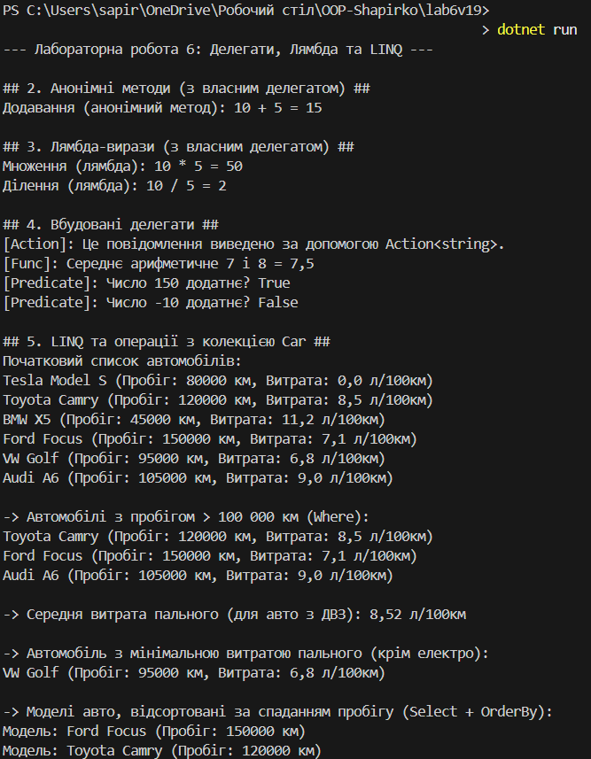

# Лабораторна робота №6

### Виконав: Шапірко Максим Вікторович ІПЗ 3/1

### Тема: Лямбда-вирази, анонімні функції та делегати у C#

Мета: Закріпити знання про делегати та події.
Навчитись використовувати анонімні методи, лямбда-вирази і вбудовані делегати (Func<>, Action<>, Predicate<>).
Отримати практичний досвід застосування лямбда-виразів у колекціях і LINQ-операціях.

У ході лабораторної роботи №6 було закріплено теми «Делегати, анонімні методи, лямбда-вирази та LINQ».
Створено модель автомобіля (Car). Продемонстровано використання власного делегату (ArithmeticOperation), анонімних методів та лямбда-виразів для опису операцій.
Продемонстровано застосування вбудованих делегатів: Action<> для виводу інформації, Func<> для обчислень та Predicate<> для перевірки умов.
Програма виконує обробку колекції List<Car> за допомогою методів LINQ (Where, Average, OrderBy, Select, Aggregate) для реалізації бізнес-логіки: розрахунку середньої витрати пального, пошуку автомобіля з мінімальною витратою та відбору за пробігом.
Таким чином закріплено навички декларативного програмування, використання функціональних підходів в C# та ефективної роботи з колекціями даних.

## Результат виводу на екран

## Висновок: 

Уході виконання лабораторної роботи я закріпив знання про делегати та події та навчився використовувати анонімні методи, лямбда-вирази і вбудовані делегати (Func<>, Action<>, Predicate<>)  також отримав практичний досвід застосування лямбда-виразів у колекціях і LINQ-операціях.

