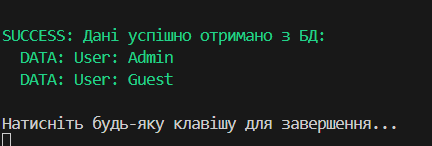

# Лабораторна робота №7

### Виконав: Шапірко Максим Вікторович ІПЗ 3/1

### Тема: Обробка IO/мережевих помилок та патерн Retry.

Мета: Навчитися обробляти типові помилки вводу/виводу та мережеві помилки за допомогою блоків try-catch-finally, а також реалізувати патерн Retry для підвищення відмовостійкості застосунків.

У ході лабораторної роботи №7 було закріплено теми «Узагальнення (Generics), обробка виняткових ситуацій та використання делегатів».
Створено класи імітації зовнішніх сервісів FileProcessor та NetworkClient. Продемонстровано реалізацію патерну проектування «Retry» (Повторна спроба) через створення узагальненого статичного класу RetryHelper.
Продемонстровано застосування вбудованих делегатів Func<> для абстрагування виконуваних операцій та логіки фільтрації винятків (shouldRetry). Реалізовано алгоритм експоненційної затримки (Exponential Backoff) для керування інтервалами між спробами.
Програма виконує надійне зчитування даних, автоматично обробляючи тимчасові помилки (FileNotFoundException, HttpRequestException) та відновлюючи роботу після збоїв без аварійного завершення.
Таким чином закріплено навички розробки стійких до відмов додатків (fault-tolerant applications), роботи з узагальненими типами в C# та ефективного керування винятками.

## Результат виводу на екран:

## Контрольні запитання: 

### 1. Які типи винятків найчастіше виникають при роботі з файлами та мережею?

Файли: FileNotFoundException (файл не знайдено), UnauthorizedAccessException (немає прав доступу), IOException (файл зайнятий іншим процесом), DirectoryNotFoundException.

Мережа: HttpRequestException (помилка HTTP-запиту), SocketException (помилка сокета/з'єднання), TimeoutException (перевищено час очікування відповіді), WebException.

### 2. Поясніть принцип роботи патерну Retry. Коли його доцільно використовувати?

Принцип: Патерн автоматично повторює виконання операції, яка завершилася невдачею, задану кількість разів із певними інтервалами очікування.

Доцільність: Використовується для обробки тимчасових (transient) помилок, які можуть зникнути самі собою через короткий час (наприклад, короткочасна втрата зв'язку, перевантаження сервера, блокування таблиці в БД). Не використовується для постійних помилок (логічних багів, невірних паролів).

### 3. Як реалізувати експоненційну затримку між повторними спробами?

Час очікування збільшується в геометричній прогресії залежно від номера поточної спроби.

Формула: Delay = InitialDelay * 2^AttemptNumber.

Це дозволяє зменшити навантаження на систему, яка вже має проблеми, даючи їй більше часу на відновлення з кожною наступною спробою.

### 4. Для чого потрібен делегат shouldRetry у допоміжному класі RetryHelper?

Він потрібен для фільтрації винятків. Делегат дозволяє визначити, чи є конкретна помилка тимчасовою і чи варто для неї робити повторну спробу.

Наприклад: Повторювати запит при TimeoutException (500), але миттєво припиняти роботу при UnauthorizedAccessException (401), оскільки повторення запиту з тим самим паролем не виправить ситуацію.

## Висновок: 
Я навчився обробляти типові помилки вводу/виводу та мережеві помилки за допомогою блоків try-catch-finally, а також реалізував патерн Retry для підвищення відмовостійкості застосунків

